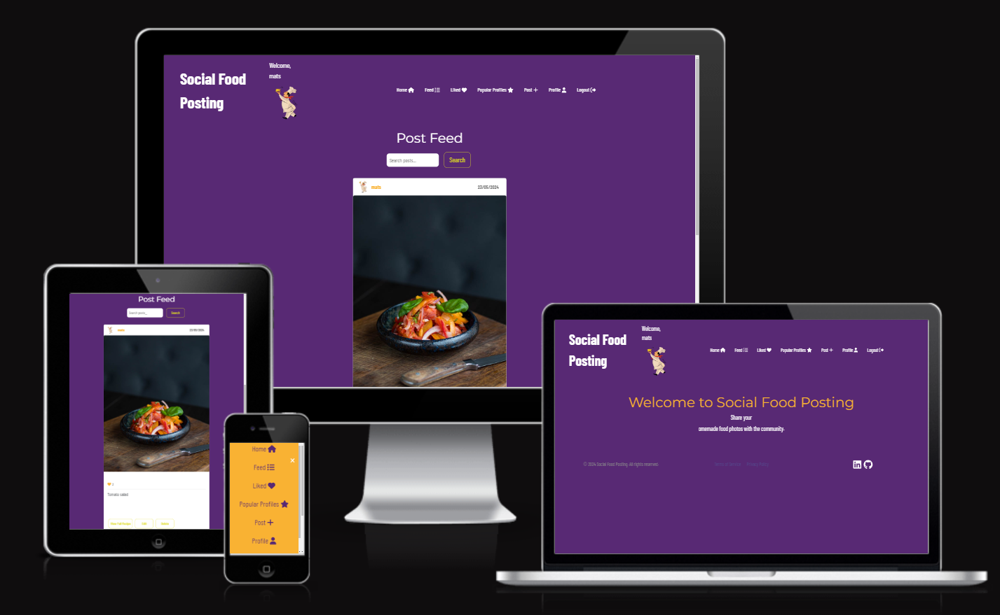
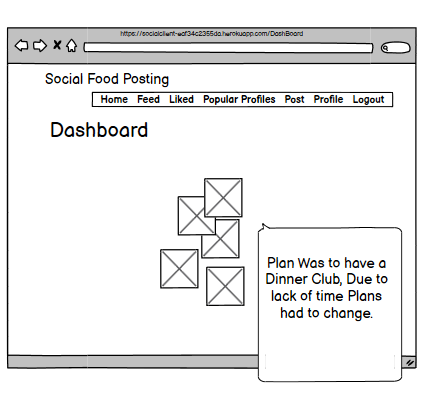
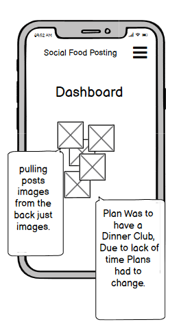

<body>

# Social Food Posting - Frontend

## Table of Contents

1.  [Project Overview](#project-overview)
2.  [Design](#design)
3.  [Technologies](#technologies)
4.  [Dependencies](#dependencies)
5.  [Reusable Components](#reuseable-components)
6.  [Setup and Installation](#setup-and-installation)
7.  [Testing](#Testing)
8.  [Deployment](#deployment)
9.  [Credits](#credits)





## 👉 [Link to Live Project](https://socialclient-eaf34c2355da.herokuapp.com/) 

## Project Overview

## Objective

The aim of the **Social Food Posting platform** is to provide a space where users can:

- Share their culinary creations.
- Connect with other food lovers.
- Organize or join dinner clubs with like-minded individuals.

## Features

### User Interaction

- **Create Posts:** Users can create posts showcasing their culinary skills.
- **Follow Users:** Follow others who share similar gastronomic interests.
- **Likes and Comments:** Interact with the community by liking and commenting on each other's content.

[Back to top](#)  

### link to the project board. 

https://github.com/users/Moonchichiii/projects/36/views/2

## Design

### Mockups
**Created with Balsamiq**
<p>
 
 
 
 
 
 
 
 

 
 
 

 
 
  
 </p>

## Mobile View
<p>
 
 
 
 
  

 **Had to skip the dinner club idea, due to time constraint**
 </p>
 
 [Back to top](#)  

### Color Palette

[Coolors Color Palette](https://coolors.co/)
<br>


- **_Fonts Used_**: 'Montserrat' for headings and 'Barlow Condensed' for text.

## Technologies

- Vite + React

## Dependencies

- `axios`
- Axios is a promise-based HTTP client compatible with node.jsand across browsers.
- `bootstrap`
- For responsive design and pre-styled components.
- `react-loader-spinner` 
- provides simple React.js spinner component which can be implemented
  for async wait operation before data load to the view
- `react-query` 
- Is a hook library for handling asynchronous and
  remote data in React applications.
  It provides features such as caching, syncing, querying, mutations.

- `lodash` 
- For utility functions, debounce in search functionality.
- `js-cookie` 
- For managing cookies,for authentication.
- `@fortawesome/free-solid-svg-icons`
- To use the iconic font, CSS, and SVG framework in your project.
- `Express` 
- Express is a fast, unopinionated, minimalist web framework for Node.js
It is used for developing servers and provides small, robust tooling for HTTP servers
- `compression` 
- https://www.npmjs.com/package/compression

[Back to top](#)

## Reusabl components

- Modal
- PostCard
- Searchbar


## Testing

### React Testing Library

- https://dev.to/mbarzeev/testing-a-simple-component-with-react-testing-library-5bc6

- https://jestjs.io/docs/tutorial-react


### 

## Setup and Installation

1.  **Clone the Repository**

    
    

2.  **Install Dependencies**
    `npm install`
3.  **Start the Development Server**
    `npm run dev`

## Configuration for deployment 

### server.js

The `server.js` file sets up an Express server to serve the built React application.
It uses the compression middleware to compress responses, improving load times. In production,
it serves the static files from the `dist` directory and handles any requests by sending the `index.html` file,
enabling client-side routing to function correctly.

```javascript
import express from 'express';
import { fileURLToPath } from 'url';
import path from 'path';
import compression from 'compression';

const filename = fileURLToPath(import.meta.url);
const dirname = path.dirname(filename);

const app = express();
const PORT = process.env.PORT || 3000;

app.use(compression());

if (process.env.NODE_ENV === 'production') {
    app.use(express.static(path.resolve(dirname, 'dist')));
    app.get('*', (req, res) => {
        res.sendFile(path.resolve(dirname, 'dist', 'index.html'));
    });
}

app.listen(PORT, () => console.log(`Server running on port ${PORT}`)); 
```

### Vite.config.js 

```javascript
import { defineConfig } from 'vite';
import react from '@vitejs/plugin-react';


// https://vitejs.dev/config/
export default defineConfig({
  plugins: [react()],
  build: {
    outDir: 'dist',
    minify: 'terser'
  },
  server: {
    proxy: {
      '/api': {
        target: process.env.VITE_BASE_URL,
        changeOrigin: true,
        secure: false,
        rewrite: path => path.replace(/^\/api/, '')
      }
    }
  }
});
```
## Deployment

### Heroku Deployment
Heroku Deployment

### Create a Heroku App

Login to the Heroku website and create a new app. 

Select your region and name your app as you want.


### Add Node.js Buildpack

In the Heroku dashboard, go to the "Settings" tab and 

click on "Add buildpack". Select "Node.js" and add it. 

This tells Heroku to use Node.js to run your application.

### Build the Project

You can either build the project before deploying or let Heroku handle the build process. 

If you want to keep the project size smaller during deployment, let Heroku run the build during deployment.

### Option 1: Build Locally

Build the project locally,:

`npm run build`
This will generate a dist folder containing the built files.

You can then move this to your backend and deploy it as one app on Heroku.

### Option 2: Let Heroku Build

If you prefer to let Heroku handle the build, no need to run the build command locally.

This approach reduces the project size during deployment.

Heroku will use the build script specified in your `package.json` to build the project during deployment.

### Prepare the Project for Heroku Deployment

**Add a Procfile**

Create a Procfile in the root of your project. 

This file tells Heroku how to run your application. Add the following line to your Procfile:

`web: node server.js `

### Configure package.json

This configuration allows Heroku to run the build script during deployment.

Ensure that your package.json includes the necessary scripts for building and running your application. 
```Javascript

  "scripts": {
    "dev": "vite",
    "build": "vite build",
    "lint": "eslint . --ext js,jsx --report-unused-disable-directives --max-warnings 0",
    "preview": "vite preview"
  },
  "engines": {
    "node": "20.x",  // This can change 
    "npm": "10.8.0"  // This can change - has changed a few times keep the up to date version. 
  },
```

### Deploy The project.

Use the Heroku GitHub integration to automatically deploy from a GitHub repository.

### Configure Environment Variables

In the Heroku dashboard, navigate to the "Settings" tab and click on "Reveal Config Vars". 

Add the necessary environment variables required to communicate with the backend and other settings. 

### Post-Deployment

After deploying, Heroku will automatically run the build script defined in package.json.

This will compile your frontend code. Your server will start according to the command defined in Procfile.

You can monitor the deployment process and application logs using the Heroku dashboard or the Heroku 


## Credits

Special thanks to:

- The Moments Walkthrough Project for guidance and inspiration

# React + Vite

This template provides a minimal setup to get React working in Vite with HMR and some ESLint rules.
Currently, two official plugins are available:

- [@vitejs/plugin-react](https://github.com/vitejs/vite-plugin-react/blob/main/packages/plugin-react/README.md) uses [Babel](https://babeljs.io/) for Fast Refresh
- [@vitejs/plugin-react-swc](https://github.com/vitejs/vite-plugin-react-swc) uses [SWC](https://swc.rs/) for Fast Refresh
</body>