# Social Food Posting - Frontend

## Table of Contents

1.  [Project Overview](#project-overview)
2.  [Design](#design)
3.  [Technologies](#technologies)
4.  [Dependencies](#dependencies)
5.  [Reusable Components](#reuseable-components)
6.  [Setup and Installation](#setup-and-installation)
7.  [Testing](#Testing)
8.  [Deployment](#deployment)
9.  [Credits](#credits)

## Project Overview

## Objective

The aim of the **Social Food Posting platform** is to provide a space where users can:

- Share their culinary creations.
- Connect with other food lovers.
- Organize or join dinner clubs with like-minded individuals.

## Features

### User Interaction

- **Create Posts:** Users can create posts showcasing their culinary skills.
- **Follow Users:** Follow others who share similar gastronomic interests.
- **Likes and Comments:** Interact with the community by liking and commenting on each other's content.

## Design

## Mockups

**Created with Balsamiq**
 
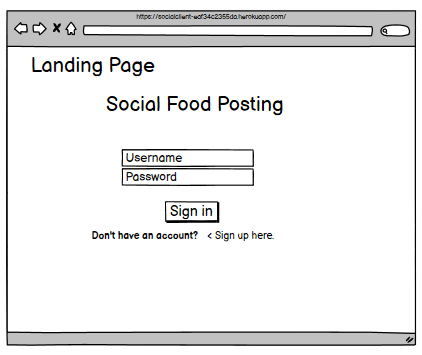 
 
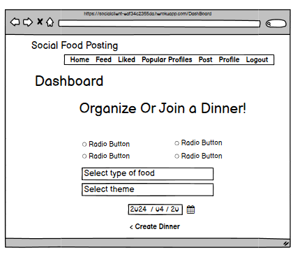 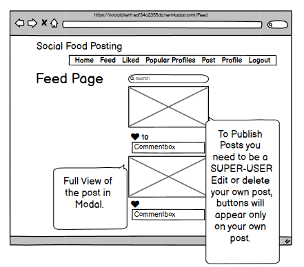
 
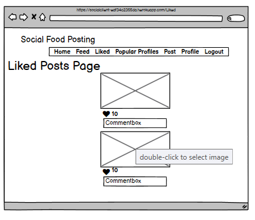 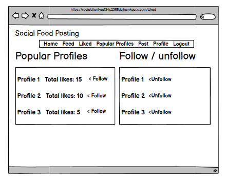
 
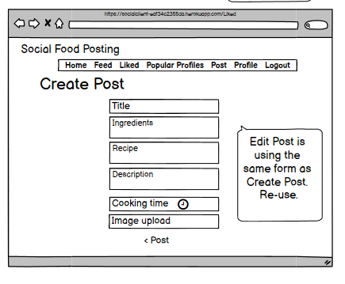 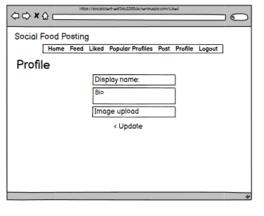

## Mobile View

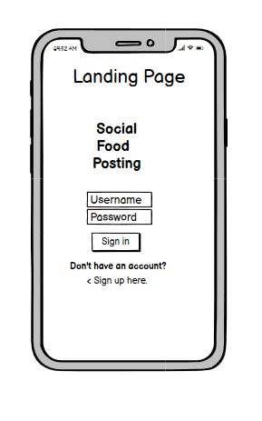 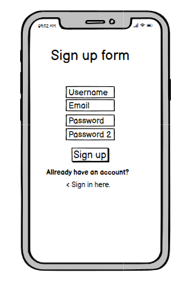

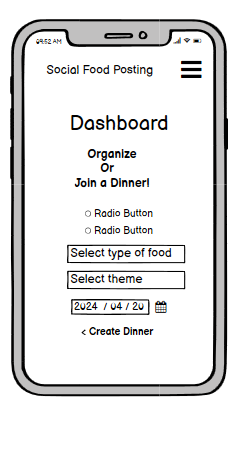 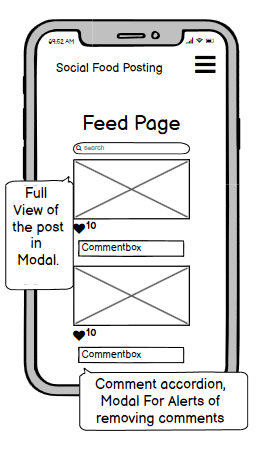

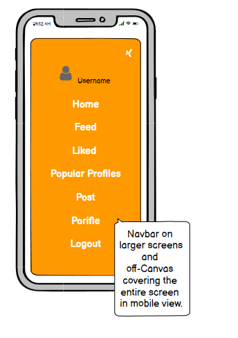

### Color Palette

[Coolors Color Palette](https://coolors.co/)
 

- **_Fonts Used_**: 'Montserrat' for headings and 'Barlow Condensed' for text.

## Technologies

- Vite + React

## Dependencies

- `axios`- Axios is a promise-based HTTP client compatible with node.jsand across browsers.
- `bootstrap`- For responsive design and pre-styled components.
- `react-loader-spinner` - provides simple React.js spinner component which can be implemented
  for async wait operation before data load to the view
- `react-query` - Is a hook library for handling asynchronous and
  remote data in React applications.
  It provides features such as caching, syncing, querying, mutations.
- `lodash` - For utility functions, debounce in search functionality.
- `js-cookie` - For managing cookies,for authentication.
- `@fortawesome/free-solid-svg-icons`- To use the iconic font, CSS, and SVG framework in your project.
- `Express` Express is a fast, unopinionated, minimalist web framework for Node.js1.

It is used for developing servers and provides small, robust tooling for HTTP servers

- `compression` - https://www.npmjs.com/package/compression

## Reusabl components

- Modal
- PostCard
- Searchbar
[back]
## Setup and Installation

1.  **Clone the Repository**

    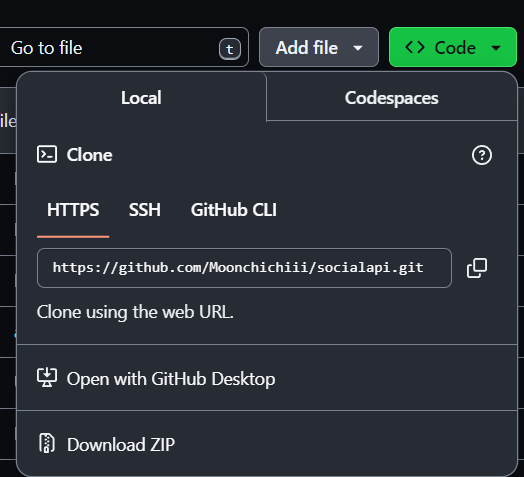
    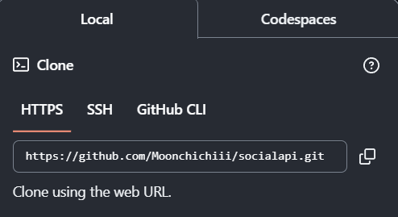

2.  **Install Dependencies**
    `npm install`
3.  **Start the Development Server**
    `npm run dev`

## Configuration File

### server.js

The `server.js` file sets up an Express server to serve the built React application.
It uses the compression middleware to compress responses, improving load times. In production,
it serves the static files from the `dist` directory and handles any requests by sending the `index.html` file,
enabling client-side routing to function correctly.

import express from 'express';
import { fileURLToPath } from 'url';
import path from 'path';
import compression from 'compression';

const **filename = fileURLToPath(import.meta.url);
const **dirname = path.dirname(\_\_filename);

const app = express();
const PORT = process.env.PORT || 3000;

app.use(compression());

if (process.env.NODE_ENV === 'production') {
app.use(express.static(path.resolve(**dirname, 'dist')));
app.get('\*', (req, res) => {
res.sendFile(path.resolve(**dirname, 'dist', 'index.html'));
});
}

app.listen(PORT, () => console.log(`Server running on port ${PORT}`));

## Deployment

### Heroku Deployment

1.  **Build the Project**
    `npm run build`
2.  **Deploy to Heroku**

## Testing

## Credits

Special thanks to:

- The Moments Walkthrough Project for guidance and inspiration

# React + Vite

This template provides a minimal setup to get React working in Vite with HMR and some ESLint rules.
Currently, two official plugins are available:

- [@vitejs/plugin-react](https://github.com/vitejs/vite-plugin-react/blob/main/packages/plugin-react/README.md) uses [Babel](https://babeljs.io/) for Fast Refresh
- [@vitejs/plugin-react-swc](https://github.com/vitejs/vite-plugin-react-swc) uses [SWC](https://swc.rs/) for Fast Refresh
