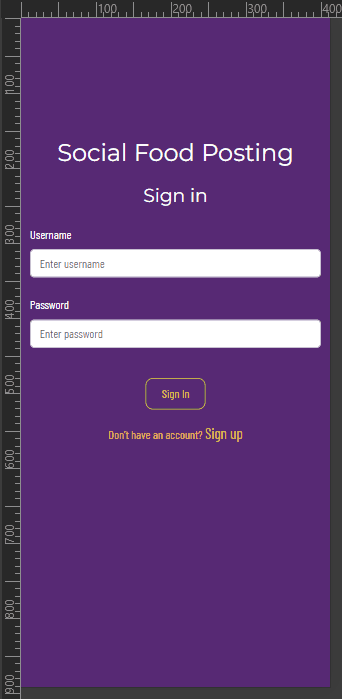

# Manual Testing

[Go to README](README.md)

## Login/Register Page

| Testcase                      | Expected Result                                                            | Test Result | Recording        |
| ----------------------------- | -------------------------------------------------------------------------- | ----------- | ----------------- |
| Open the Login/Register Page  | Login/Register Page loads and displays the login form by default           |             | [Recording](readmecontent/testimages/test/LoginWithCorrectData.gif) |
| Switch to Register Form       | Clicking the switch button shows the registration form                     |             | [Recording](readmecontent/testimages/test/SwitchingForms.gif) |
| Register a user with valid data| Request is successful, user is registered and logged in                    |           | [Recording](readmecontent/testimages/test/RegisteringNewUser.gif) |             
| Register a user with invalid data| Request fails, form reloads, error displayed                         |             |    [Recording](readmecontent/testimages/test/RegisteringNewUserWithWrongData.gif)  |
| Login a user with valid data  | Request is successful, user is logged in                                   |             | [Recording](readmecontent/testimages/test/LoginCorrectPassword.gif) |
| Login a user with invalid data| Request fails, form reloads, error displayed                           |             | [Recording](readmecontent/testimages/test/LoginWrongPassword.gif)    |
## Dashboard
| Testcase                      | Expected Result                                                            | Test Result | Recording        |
| ----------------------------- | -------------------------------------------------------------------------- | ----------- | ----------------- |
| Open the Dashboard            | Dashboard loads and displays a welcome text and the navigation bar         |             | [Recording](readmecontent/testimages/test/DashBoardClickOnHomeAndBrandLogoGoingtoFeedPage.gif) |
## Navigation
| Testcase                      | Expected Result                                                            | Test Result | Recording        |
| ----------------------------- | -------------------------------------------------------------------------- | ----------- | ----------------- |
| Navigate to Liked             | Clicking Liked navigates to the Liked page                                 |             |                                                                                     |
| Navigate to Popular Profiles  | Clicking Popular Profiles navigates to the Popular Profiles page           |             |                                                                                     |
| Navigate to Post              | Clicking Post navigates to the Post creation page                          |             |                                                                                     |
| Navigate to Profile           | Clicking Profile navigates to the Profile page                             |             |                                                                                     |
| Navigate to Home              | Clicking Home navigates to the (dashboard)                                 |             | [Recording](readmecontent/testimages/test/DashBoardClickOnHomeAndBrandLogoGoingtoFeedPage.gif) |
| Navigate to Feed              | Clicking Feed navigates to the Feed page                                   |             | [Recording](readmecontent/testimages/test/DashBoardClickOnHomeAndBrandLogoGoingtoFeedPage.gif) |
| Logout                        | Clicking Logout logs out the user and navigates to the login page          |             | [Recording](readmecontent/testimages/test/NavigationAndLogout.gif)    |
## Feed Page
| Testcase                      | Expected Result                                                            | Test Result | Recording        |
| ----------------------------- | -------------------------------------------------------------------------- | ----------- | ----------------- |
| Open the Feed Page            | Feed page loads and displays posts.                                        |             | [Recording](readmecontent/testimages/test/SearchOnFeedPage.gif)       |
| Use Search Bar                | Entering keywords and submitting shows search results                      |             | [Recording](readmecontent/testimages/test/SearchOnFeedPage.gif)       |
## Liked Page
| Testcase                      | Expected Result                                                            | Test Result | Recording        |
| ----------------------------- | -------------------------------------------------------------------------- | ----------- | ----------------- |
| Open the Liked Page           | Liked page loads and displays posts liked by the user                      |             |                                                                                     |
## Popular Profiles Page
| Testcase                      | Expected Result                                                            | Test Result | Recording        |
| ----------------------------- | -------------------------------------------------------------------------- | ----------- | ----------------- |
| Open the Popular Profiles Page| Popular profiles page loads and displays the most popular profiles and following list |             |                                                                                     |
| Follow a Profile              | Clicking follow button successfully follows a profile                      |             | [Recording](readmecontent/testimages/test/FollowAndUnFollow.gif)       |
| Unfollow a Profile            | Clicking unfollow button successfully unfollows a profile                  |             | [Recording](readmecontent/testimages/test/FollowAndUnFollow.gif)       |
## Post Page
| Testcase                      | Expected Result                                                            | Test Result | Recording        |
| ----------------------------- | -------------------------------------------------------------------------- | ----------- | ----------------- |
| Create a Post with valid data | Request is successful, post is created.                                     |             | [Recording](readmecontent/testimages/test/CreatePost.gif)             |
| Create a Post with invalid data| Request fails, form shows error                                           |             | [Recording](readmecontent/testimages/test/CreatePost.gif)             |
| Edit a Post with valid data   | Request is successful, post is updated.                                    |             | [Recording](readmecontent/testimages/test/EditPost.gif)               |
| Edit a Post with invalid data | Request fails, form shows error                                            |             | [Recording](readmecontent/testimages/posts/EditPost3.png)             |
| Delete a Post                 | Request is successful, post is deleted,                                    |             | [Recording](readmecontent/testimages/test/DeletePost.gif)             |
## Profile Page
| Testcase                      | Expected Result                                                            | Test Result | Recording        |
| ----------------------------- | -------------------------------------------------------------------------- | ----------- | ----------------- |
| Open Profile                  | Profile page loads and displays correct user data                          |             | [Recording](readmecontent/testimages/test/ProfileUpdate.gif)          |
| Edit Profile                  | Request is successful, profile is updated.                                 |             | [Recording](readmecontent/testimages/test/ProfileUpdate.gif)          |
## Post Interaction
| Testcase                      | Expected Result                                                            | Test Result | Recording        |
| ----------------------------- | -------------------------------------------------------------------------- | ----------- | ----------------- |
| Open a post by clicking "view full recipe" | Post detail page loads with correct data                            |       | [Recording](readmecontent/testimages/test/ViewFullRecipe.gif)         |
| Open a post through URL       | Post detail page loads with correct data                                   |             | [Recording](readmecontent/testimages/test/ViewFullPost.gif)           |
| Liking a post                 | Like count increases                                                       |             | [Recording](readmecontent/testimages/test/LikeAndUnlikePost.gif)      |
| Unliking a post               | Like count decreases                                                       |             | [Recording](readmecontent/testimages/test/LikeAndUnlikePost.gif)      |
| Publish a post (Superuser)    | Request is successful, post is published                                   |             | [Recording](readmecontent/testimages/test/PublishNewPost.gif)         |
## Commenting
| Testcase                      | Expected Result                                                            | Test Result |  Recording       |
| ----------------------------- | -------------------------------------------------------------------------- | ----------- | ----------------- |
| Writing a comment             | Request is successful, comment is added to the list, message is shown      |             | [Recording](readmecontent/testimages/test/AddCommentEditCommentDeleteComment.gif) |
| Editing a comment             | Request is successful, comment content is updated, message is shown        |             | [Recording](readmecontent/testimages/test/AddCommentEditCommentDeleteComment.gif) |
| Delete a comment              | Request is successful, comment is deleted, message is shown                |             | [Recording](readmecontent/testimages/test/AddCommentEditCommentDeleteComment.gif) |
## Mobile View

